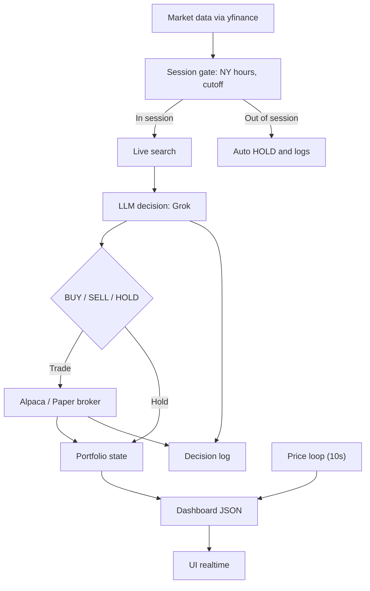

# Grok-Agentic-Trader

Autonomous Grok-powered trading bot (Day Trader) that integrates with **Alpaca Markets** for real and paper trading.

## How it works



## Quickstart

1) Create venv + install deps:
```bash
python3 -m venv .venv
source .venv/bin/activate
pip install -r requirements.txt
```

2) Configure API keys:
```bash
cp .env.example .env
# Edit .env with your Grok API Key and Alpaca API Keys
```

3) Run bot + UI:
```bash
./scripts/run_live.sh
```

4) Open the UI: `http://localhost:8000`

## VPS (tmux)

Run in a tmux session so it keeps running after you close VSCode/SSH:

```bash
tmux new -s grok
./scripts/run_live.sh
```

Detach (leave it running):
```
Ctrl+b, then d
```

Re-attach:
```bash
tmux attach -t grok
```

Stop:
Press `CTRL+C` inside tmux.

Live logs:
```bash
tail -f data/run.log
```

## Security (CRITICAL for VPS)

If running on a public VPS, your dashboard (port 8000) is visible to the entire internet.

**Action Required:**

1.  Use the `run_live.sh` script (it secures the server by hiding your `.env` file).
2.  **Configure your VPS Firewall** (Hetzner/AWS/DigitalOcean) to restrict Port 8000 access:
    *   **Allow**: TCP 8000 from `YOUR_HOME_IP` ONLY.
    *   **Deny**: TCP 8000 from `0.0.0.0/0` (Anywhere else).

This prevents unauthorized access to your dashboard and potential data theft.

## Features & Rules

- **Broker**: Fully integrated with **Alpaca Markets** (Paper or Live).
- **Intraday Only**: 
  - Trades only during NYSE hours (15:30 - 22:00 FR / 09:30 - 16:00 NY).
  - **Force Close**: All positions are automatically liquidated at 22:00 FR (16:00 NY). No overnight risk.
- **Safety First**:
  - **Stop Loss (SL)**: MANDATORY for every BUY. Auto-managed.
  - **Take Profit (TP)**: Optional (can be null for unrestricted gains).
- **Assets**: US-listed Equities only (No Crypto, No FX).
- **Auto-Sync**: On a fresh start (empty `data/` folder), the bot automatically syncs its starting cash with your Alpaca balance for correct PnL tracking.

## Configuration (`config/settings.json`)

- **trading.broker**: `"alpaca"` (Recommended) or `"paper"`.
- **trading.starting_cash**: Auto-updated from Alpaca on reset.
- **live_search**: Enable/Disable Grok's web browsing capability.

## Resetting for a Fresh Start

To reset the bot (e.g., when switching from Paper to Live or adding funds):
1. Stop the bot (`Ctrl+C`).
2. Delete the local data: `rm -rf data/*`.
3. Restart: `./scripts/run_live.sh`.

The bot will detect the fresh start and align itself with your Alpaca account balance.

## Disclaimer

Educational use only. Not financial advice. Use at your own risk.
