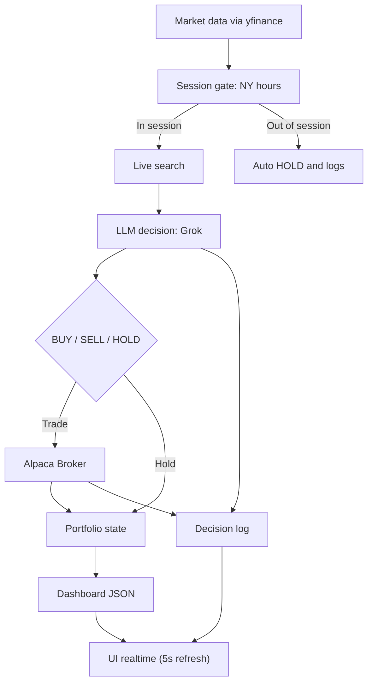

# Grok-Agentic-Trader

Autonomous **Swing Trading** bot powered by **Grok (xAI)**, now integrated with **Alpaca Markets** for commission-free trading.

## 🚀 Key Features

*   **Brain**: Uses Grok (xAI) to analyze market data, sentiment, and make trading decisions.
*   **Broker**: Fully integrated with **Alpaca Markets** (Paper & Live).
*   **Strategy**: **Swing Trading (T+1)**.
    *   **No Day Trading**: Positions are held at least overnight.
    *   **Same-Day Guard**: Hard-coded protection preventing same-day sales (PDT rule safe).
    *   **Long Only**: No short selling.
*   **Risk Management**:
    *   **Mandatory Stop Loss**: calculated dynamically (ATR-based).
    *   **Total PnL Tracking**: Clear view of real performance vs open positions.
*   **UI**: Ultra-lightweight real-time dashboard (refresh every 5s).

## 🛠️ How it works



## ⚡ Quickstart

### 1. Prerequisites
*   Python 3.10+
*   Alpaca Account (Paper or Live)
*   xAI (Grok) API Key

### 2. Installation
```bash
# Clone
git clone https://github.com/tlm159/Grok-Agentic-Trader.git
cd Grok-Agentic-Trader

# Virtual Env
python3 -m venv .venv
source .venv/bin/activate

# Install Deps
pip install -r requirements.txt
```

### 3. Configuration
Copy the example env file and add your keys:
```bash
cp .env.example .env
nano .env
```
Fill in:
*   `XAI_API_KEY`
*   `ALPACA_API_KEY`
*   `ALPACA_SECRET_KEY`

### 4. Run It 🚀
```bash
./scripts/run_live.sh
```
> **Note**: This script automatically handles security (hides .env) and starts the server.

### 5. Access Dashboard
Open `http://localhost:8000` in your browser.

## 🖥️ Dashboard Logic

*   **Total PnL**: Your real bottom line (`Current Equity - Starting Cash`). The trusted metric.
*   **Open PnL**: Performance of *currently held* positions only.
*   **Sync**: Prices and portfolio data update every **5 seconds**.
*   **Grok Decision**: New analysis every **30 minutes**.

## 🛡️ Safety Mechanisms

1.  **Same-Day Sell Guard**: Impossible to sell a stock bought the same day.
2.  **Market Hours Only**: Sleeps when NYSE is closed.
3.  **Crash Recovery**: Portfolio state persists in `data/state.json`. If you restart, it remembers when positions were opened.

## ☁️ VPS Deployment (tmux)

Run in a tmux session so it keeps running after you disconnect:

```bash
tmux new -s grok
./scripts/run_live.sh
# Detach with: Ctrl+b, then d
```

**Security Warning**: If running on a VPS, firewall port 8000 to YOUR IP only.

- **Auto-Sync**: On a fresh start (empty `data/` folder), the bot automatically syncs its starting cash with your Alpaca balance.

## Configuration (`config/settings.json`)

- **trading.starting_cash**: Auto-updated from Alpaca on reset.
- **live_search**: Enable/Disable Grok's web browsing capability.

## Resetting for a Fresh Start

To reset the bot (e.g., when switching from Paper to Live or adding funds):
1. Stop the bot (`Ctrl+C`).
2. Delete the local data: `rm -rf data/*`.
3. Restart: `./scripts/run_live.sh`.

The bot will detect the fresh start and align itself with your Alpaca account balance.

## Disclaimer

Educational use only. Not financial advice. Use at your own risk.
