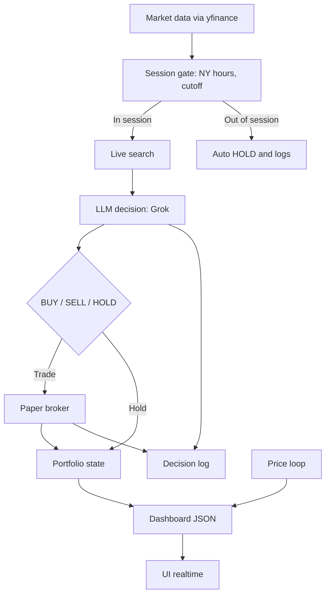

# Grok-Agentic-Trader

Autonomous Grok-powered trading bot (paper trading) with a lightweight real-time UI.

## How it works



## Quickstart (Linux)

1) Create venv + install deps:
```bash
python3 -m venv .venv
source .venv/bin/activate
pip install -r requirements.txt
```

2) Add your API key:
```bash
cp .env.example .env
# then edit .env
```

3) Run bot + UI:
```bash
./scripts/run_live.sh
```

4) Open the UI:
```
http://localhost:8000
```

5) Stop:
Press `CTRL+C` in the same terminal.

## VPS (tmux)

Run in a tmux session so it keeps running after you close VSCode/SSH:

```bash
tmux new -s grok
./scripts/run_live.sh
```

Detach (leave it running):
```
Ctrl+b, then d
```

Re-attach:
```bash
tmux attach -t grok
```

Stop:
Press `CTRL+C` inside tmux.

Live logs:
```bash
tail -f data/run.log
```

## Live UI

The UI auto-refreshes and reads `data/dashboard.json`.
Open `http://localhost:8000` after starting `./scripts/run_live.sh`.

## Trading rules (current behavior)

- US-listed equities only (crypto/FX blocked).
- New York session only (auto-handles DST; shown in Paris time).
- No new positions 30 minutes before NY close.
- All open positions are closed at NY close (22:00 FR).
- No trading on weekends.
- BUY requires both SL/TP; Grok can adjust SL/TP via HOLD.
- Decision loop runs every `cycle_minutes` (default 30 min).

## What the AI does

Each cycle (during NY session), Grok receives:
- Portfolio state (cash, open positions, SL/TP, PnL).
- Market snapshot from yfinance.
- Live search context (latest market news/sentiment).
- Recent events and decision memory.

Then it returns a single JSON decision:
- `action`: BUY / SELL / HOLD.
- `symbol`: US-listed ticker to trade.
- `notional`: amount to allocate.
- `sl_price` / `tp_price`: mandatory for BUY.
- `reason`, `reflection`, `evidence`: French explanation of its choice.

The AI can also:
- Choose HOLD when there is no high‑conviction setup (no forced trades).
- Adjust SL/TP on existing positions via HOLD.

## Live search and cost control

You can keep live search on while limiting costs:
- `live_search.max_queries_per_run`: limit queries per cycle
- `live_search.cooldown_minutes`: reuse cached results for this long
- `live_search.max_sources`: sources per query (each source is billed)

## Live Search (optional)

The bot can optionally call xAI live search to pull recent market context.

1) Enable in `config/settings.json`:
```json
\"live_search\": { \"enabled\": true }
```

2) Install the SDK:
```bash
pip install -r requirements.txt
```

Note: live search uses extra paid sources. You are billed by xAI for live search usage.

## Config

- `config/settings.json`: model, base_url, trade mode (paper), and risk flags.
- `config/settings.json` also controls `starting_cash` if no state exists yet.
- Runtime data is stored in `data/` (state, trades, dashboard), but it is ignored by git.

## Notes

- Prices come from Yahoo Finance via `yfinance`.
- The bot chooses any US-listed ticker it wants (crypto/FX are blocked).
- `scripts/run_live.sh` includes a lockfile to prevent multiple loops and avoid extra API costs.
- If the UI shows "Decision invalide", inspect the raw model output in `data/trades.jsonl`.
- Text logs are written to `data/run.log` for quick inspection without the UI.
  - Live tail: `tail -f data/run.log`

## Disclaimer

Educational use only. Not financial advice.
