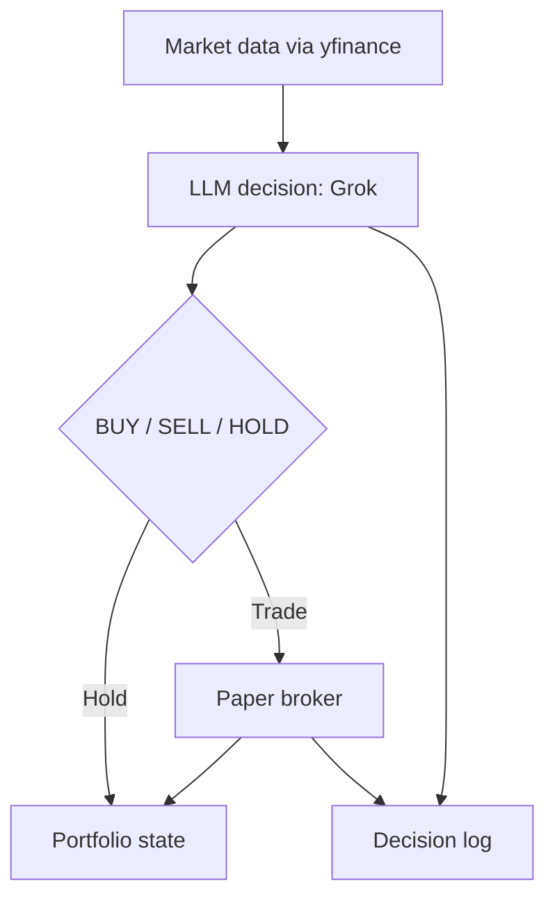

# Grok-Agentic-Trader

Autonomous Grok-powered trading bot (paper trading). The LLM decides what to trade and when. No guardrails by default.

## How it works



## Quickstart

1) Install deps:
```bash
python -m venv .venv
source .venv/bin/activate
pip install -r requirements.txt
```

2) Add your API key:
```bash
cp .env.example .env
# then edit .env
```

3) Run once:
```bash
python src/main.py
```

## Live UI

This lightweight UI reads `data/dashboard.json` and auto-refreshes.

1) Run the bot loop in one terminal:
```bash
python src/loop.py
```

2) Serve the UI in another terminal:
```bash
python -m http.server 8000
```

Open `http://localhost:8000/ui/simple/`.

Or run both with one command:

```bash
./scripts/run_simple_live.sh
```

Or run the bot once and then open the UI:

```bash
./scripts/run_dashboard.sh
```

Or run the bot in a loop and keep the UI auto-refreshing:

```bash
./scripts/run_live.sh
```

The live scripts also run a lightweight price loop (no AI) to refresh PnL in real time.

## Live Search Cost Control

You can keep live search on while limiting costs:
- `live_search.max_queries_per_run`: limit queries per cycle
- `live_search.cooldown_minutes`: reuse cached results for this long

## Live Search (optional)

The bot can optionally call xAI live search to pull recent market context.

1) Enable in `config/settings.json`:
```json
\"live_search\": { \"enabled\": true }
```

2) Install the SDK:
```bash
pip install -r requirements.txt
```

Note: live search uses extra paid sources. You are billed by xAI for live search usage.

## Config

- `config/settings.json`: model, base_url, trade mode (paper), and risk flags.
- `config/settings.json` also controls `starting_cash` if no state exists yet.
- `data/state.json`: starting cash and current positions.
- `data/trades.jsonl`: decisions, prompts, and trades log.

## Notes

- Prices come from Yahoo Finance via `yfinance`.
- The bot chooses any ticker it wants (US stocks or crypto pairs like `BTC-USD`).

## Disclaimer

Educational use only. Not financial advice.
